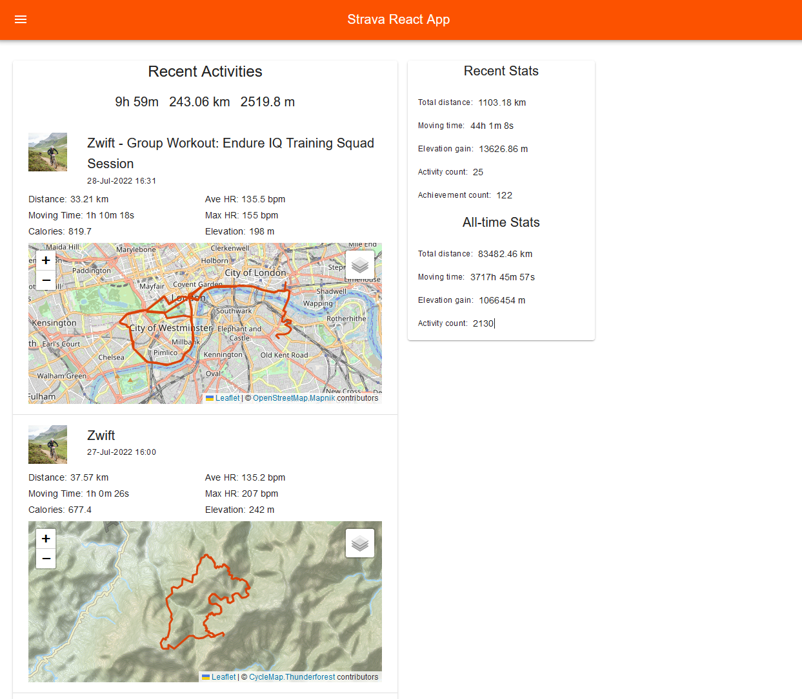

# Strava App

**Overview:**

Basic React TypeScript app pulling data from Strava and visualizing it in React Leaflet

**Tech stack:**

- [Yarn](https://yarnpkg.com/)
- React TypeScript
- [Material UI](https://mui.com/getting-started/installation/)
- React Testing Library
- [Redux Toolkit](https://redux-toolkit.js.org/) - used for local app state like modal open/closed, selected rows etc.
- [Redux Saga](https://redux-saga.js.org/).
- [React-Leaflet Maps](https://react-leaflet.js.org/docs/start-introduction/)
- [Github Actions](https://github.com/features/actions) for running checks - CI workflow can be seen [here](https://github.com/loanburger/products-redux-saga/blob/main/.github/workflows/build_test_react.yml)

**Instructions:**

1. You will need to have a configured app in strava to get you OAuth Info.
2. Once you have this setup, update the `.env.development` file by adding the values for the environmental variables:
3. Save :wink:

```
REACT_APP_STRAVA_CLIENT_ID=your_client_id
REACT_APP_STRAVA_CLIENT_SECRET=your_client_secret
REACT_APP_STRAVA_CALLBACK_URL=http://localhost:3000
```

**Running the app**:

1. Run `yarn install`
2. Run `yarn start:dev`

**Testing the app:**

1. `Run yarn test` or
2. `Run yarn watch` or
3. `Run test:coverage` or
4. `Run test:premerge`

**Preview:**



**Strava Api documentation:**

- [Strava API V3 API and SDK Reference](https://developers.strava.com/docs/reference)
- [Strava Swagger Playground](https://developers.strava.com/playground/#/)

**Known Issues:**

- All tests that interact with the React-Leaflet components are currently failing
